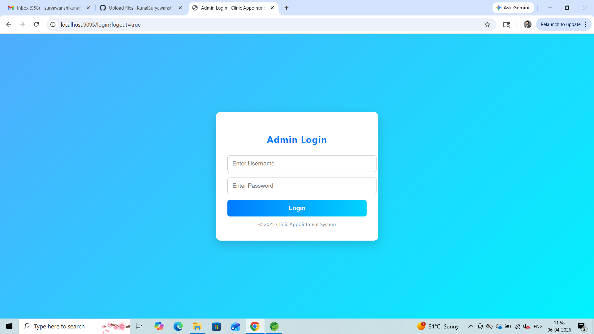
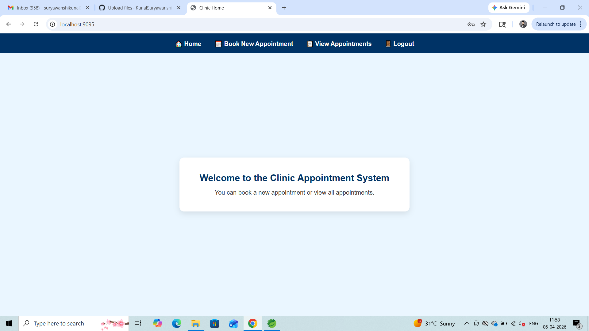
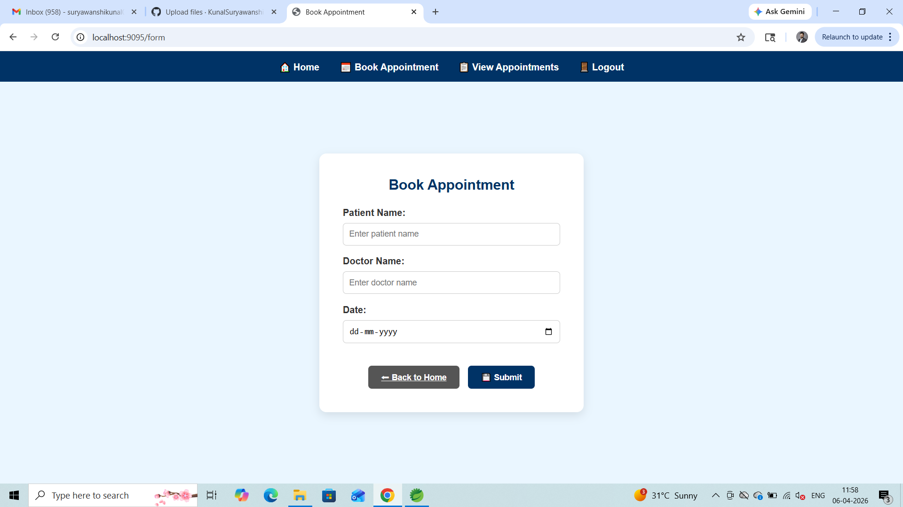
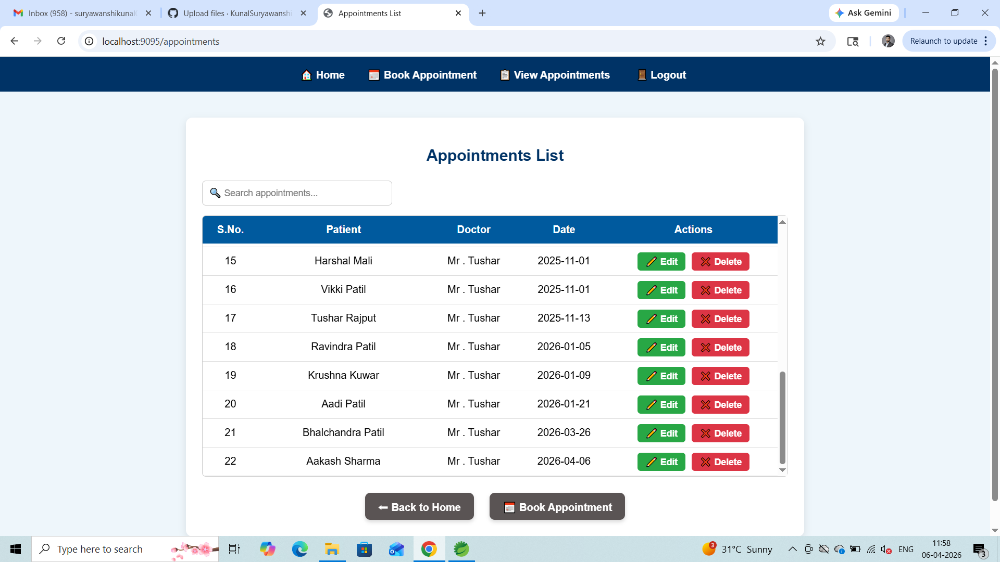

# 🏥 Clinic Appointment System

A **full-stack web application** built using **Spring Boot, Spring MVC, Thymeleaf, and MySQL** that allows patients to book, edit, and cancel appointments efficiently.  
This project demonstrates **secure authentication, authorization, and logout functionality** using **Spring Security**, along with a clean and responsive UI.

---

## 🚀 Features

✅ **Admin Authentication** – Secure login for admin using Spring Security  
✅ **Authorization** – Restricts access to sensitive routes (only logged-in users allowed)  
✅ **Secure Logout (CSRF Protected)** – Logout implemented with POST form and CSRF token  
✅ **CRUD Operations** – Create, Read, Update, Delete appointments  
✅ **Search & Filter** – Find appointments by doctor name or date  
✅ **Flash Messages** – Shows success messages after booking or updating  
✅ **Responsive UI** – Built with HTML, CSS, and Thymeleaf  
✅ **Validation & Error Handling** – Prevents invalid or duplicate entries  

---

## 🛠️ Tech Stack

**Backend:** Java, Spring Boot, Spring MVC, Spring Data JPA, Spring Security  
**Frontend:** HTML5, CSS3, Thymeleaf  
**Database:** MySQL  
**Tools:** Spring Tool Suite / Eclipse, MySQL Workbench, Postman, Git, GitHub  
**Core Concepts:** OOPs, Exception Handling, Java 8, Clean Code Principles  

---

## 🧩 Application Flow

1️⃣ Admin logs in securely via `/login`  
2️⃣ Redirected to **Home Page** (`/`)  
3️⃣ Admin can:  
   - 📅 Book new appointments (`/form`)  
   - 📋 View all appointments (`/appointments`)  
   - ✏️ Edit or ❌ Delete existing ones  
4️⃣ 🔐 Logout securely with CSRF token  

---

## 🧠 Security Highlights

- Implemented **Spring Security** for authentication & role-based access.  
- Used **CSRF token** in logout form for secure POST-based logout.  
- Invalidates session and deletes cookies on logout.  

---


## 📸 Application Screenshots

### 🔐 Login Page


### 🏠 Home Page


### 📝 Booking Form


### 📋 Appointments List


---


## 🧑‍💻 Developer

**👨‍💻 Kunal Suryawanshi**  
*Java Full Stack Developer | Passionate about clean, secure, and scalable web applications.*  

📧 **Email:** [suryawanshikunal011@gmail.com](mailto:suryawanshikunal011@gmail.com)  
🔗 **LinkedIn:** [linkedin.com/in/kunalsuryawanshi53](https://linkedin.com/in/kunalsuryawanshi53)  
💻 **GitHub Profile:** [github.com/KunalSuryawanshi53](https://github.com/KunalSuryawanshi53)  
📂 **Project Repository:** [ClinicAppointmentSystem](https://github.com/KunalSuryawanshi53/ClinicAppointmentSystem)

---

## 🏁 How to Run

1️⃣ **Clone the repository**  
```bash
git clone https://github.com/KunalSuryawanshi53/ClinicAppointmentSystem.git

